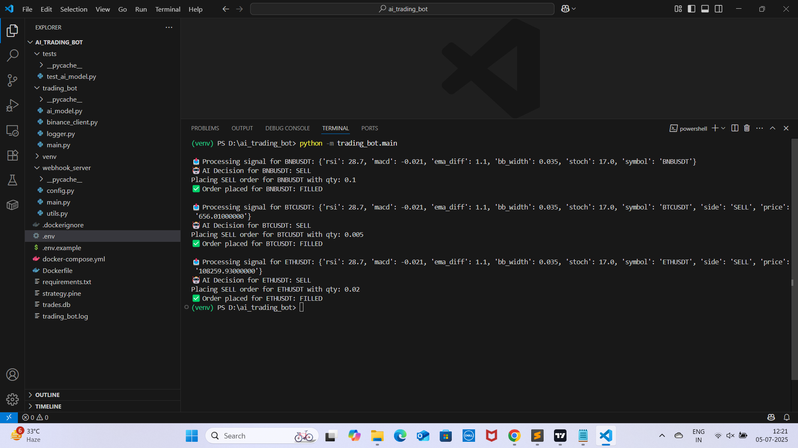
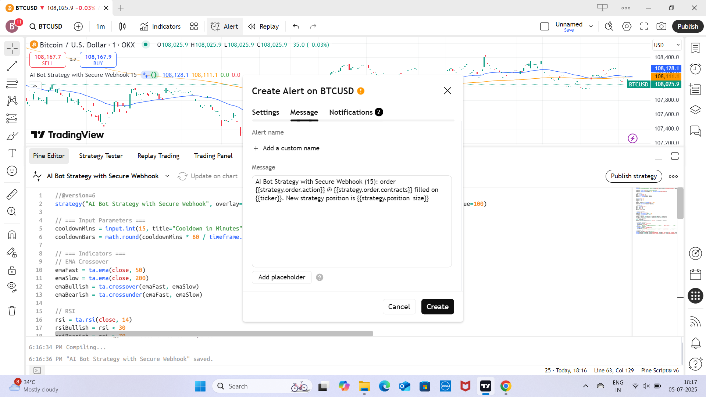

# 🤖 AI-Powered Trading Bot System

An intelligent crypto trading bot built with Python, Binance Testnet, TradingView Webhooks, and FastAPI. Uses AI signals like RSI, MACD, EMA crossovers, and more to make automated buy/sell decisions.

---

## 📁 Project Structure


---

## 📸 Screenshots

| 📈 TradingView              | ⚙️ Webhook Server         | ✅ Trade Log              |
|----------------------------|---------------------------|---------------------------|
|  |  |  |
|  |  |  |
|  |  |

---

## 🔐 API Keys & Setup

### 🔑 1. TradingView Webhook API Key

Generate from [uuidgenerator.net](https://www.uuidgenerator.net)
```env
API_KEY=tradingview_webhook_uk_bot  #create your own key 
SECRET_KEY=d4f0c532-3905-449f-b7da-69ee07125da7  # generate from uuidgenerator.net

🔑 2. Binance Testnet Keys
Create from https://testnet.binance.vision

BINANCE_API_KEY=your_testnet_api_key   
BINANCE_API_SECRET=your_testnet_api_secret   
USE_TESTNET=true

⚙️ Example .env File

API_KEY=tradingview_webhook_uk_bot  #create your own key 
SECRET_KEY=d4f0c532-3905-449f-b7da-69ee07125da7    # generate from uuidgenerator.net

#Create from https://testnet.binance.vision

BINANCE_API_KEY=your_testnet_api_key
BINANCE_API_SECRET=your_testnet_api_secret
USE_TESTNET=true

SYMBOLS=BNBUSDT,BTCUSDT,ETHUSDT

MAX_POSITION_SIZE=0.01
COOLDOWN_SECONDS=60

MAX_POSITION_SIZE_BNB=0.1
MAX_POSITION_SIZE_ETH=0.02
MAX_POSITION_SIZE_BTC=0.005

🧪 Run Locally (Virtual Environment)

1️⃣ Clone the Repo

git clone https://github.com/SarabpreetBedi/AI-Powered-Trading-Bot-System.git
cd AI-Powered-Trading-Bot-System

2️⃣ Setup Virtual Environment

python -m venv venv

Activate (choose your OS):
For Windows:
venv\Scripts\activate
For MacOS/Linux:
source venv/bin/activate

3️⃣ Install Dependencies

pip install -r requirements.txt

4️⃣ Create .env File

cp .env.example .env
Edit .env with your API keys.

5️⃣  Run the Webhook Server (Locally)

uvicorn webhook_server.main:app --reload --port 8000

6️⃣ Test Signal Manually

python -m trading_bot.main

🐳  Run via Docker (Optional)

1️⃣ Build and Start

docker-compose up --build

2️⃣ Access API Docs
Visit:
http://localhost:8000/docs

3️⃣ Test Webhook Manually

curl -X POST http://localhost:8000/webhook \
  -H "Content-Type: application/json" \
  -d '{"symbol": "BTCUSDT", "rsi": 30, "macd": -0.1, "side": "buy"}'


📡 Connect to TradingView
✅ Example Pine Script Alert Payload
pinescript

alert('{' +
  '"api_key": "tradingview_webhook_uk_bot",' +  #create and use your own key
  '"symbol": "' + syminfo.ticker + '",' +
  '"price": "' + str.tostring(close) + '",' +
  '"side": "buy",' +
  '"rsi": "' + str.tostring(rsi) + '",' +
  '"macd": "' + str.tostring(macdLine) + '"' +
'}', freq=alert.freq_once_per_bar)


🔗 Webhook URL
text

http://<your-server-ip>:8000/webhook
Ensure port 8000 is open if you're using a cloud VPS.

✅ Features
🤖 AI-based decision making (RSI, MACD, EMA crossover)

🧠 LSTM & rule-based logic

🔄 Symbol-specific trade sizing

⏳ Cooldown management per symbol

🧾 Trade logging to SQLite

⚡ FastAPI webhook endpoint

🐳 Docker & virtual environment support

🧪 Run Unit Tests

pytest tests/

⚠️ Disclaimer
This bot operates exclusively on the Binance Testnet. It is also compatible with the live Binance API
at the production level, accessible via the URL: https://www.binance.com/en/my/settings/api-management.

1) The bot is designed to work with Binance Testnet by default. If you want to trade live, you can change the configuration to point to the live Binance API.
2)Ensure that you have sufficient knowledge about risk management and that you’re operating in a test environment before going live.

✅ Goal
Add deployment support for the Trading Bot system on Render.com, so it automatically starts the FastAPI webhook server with environment variables from .env.

🚀 Steps to Deploy to Render
1️⃣ Prepare Render Configuration
Render uses a render.yaml (or you can configure via the dashboard) to define services. For a FastAPI + Uvicorn app, here’s what you need:

✅ render.yaml (Place this in the root directory)

services:
  - type: web
    name: trading-bot-webhook
    env: python
    buildCommand: "pip install -r requirements.txt"
    startCommand: "uvicorn webhook_server.main:app --host 0.0.0.0 --port 8000"
    plan: free
    envVars:
      - key: API_KEY
        value: tradingview_webhook_uk_bot
      - key: SECRET_KEY
        value: d4f0c532-3905-449f-b7da-69ee07125da7
      - key: BINANCE_API_KEY
        value: your_testnet_api_key
      - key: BINANCE_API_SECRET
        value: your_testnet_api_secret
      - key: USE_TESTNET
        value: true
      - key: SYMBOLS
        value: BNBUSDT,BTCUSDT,ETHUSDT
      - key: MAX_POSITION_SIZE
        value: 0.01
      - key: COOLDOWN_SECONDS
        value: 60
      - key: MAX_POSITION_SIZE_BNB
        value: 0.1
      - key: MAX_POSITION_SIZE_ETH
        value: 0.02
      - key: MAX_POSITION_SIZE_BTC
        value: 0.005
💡 You can also use Render’s dashboard UI to manually add these environment variables under your web service settings.

2️⃣ Make the Project Render-Compatible
Ensure the following are in place:

requirements.txt – already present.

webhook_server/main.py – FastAPI entry point is correct.

startCommand in render.yaml uses uvicorn.

3️⃣ Push Your Repo to GitHub
If not already done:
git init
git remote add origin https://github.com/yourusername/your-repo.git
git add .
git commit -m "Add Render deployment support"
git push -u origin main

4️⃣ Deploy on Render
Go to https://dashboard.render.com

Click "New Web Service"

Connect your GitHub repo

Select the correct branch

Choose the environment as Python

If not using render.yaml, paste the Start Command:

uvicorn webhook_server.main:app --host 0.0.0.0 --port 8000
Add all environment variables via UI

✅ Optional: Add Render Badge

[](https://render.com/deploy)

📡 Webhook URL on Render

Once deployed, your public webhook will be:

https://<your-render-app-name>.onrender.com/webhook
Use this in your TradingView alerts.


📝 License
MIT License

👨‍💻 Author
Sarabpreet Bedi
